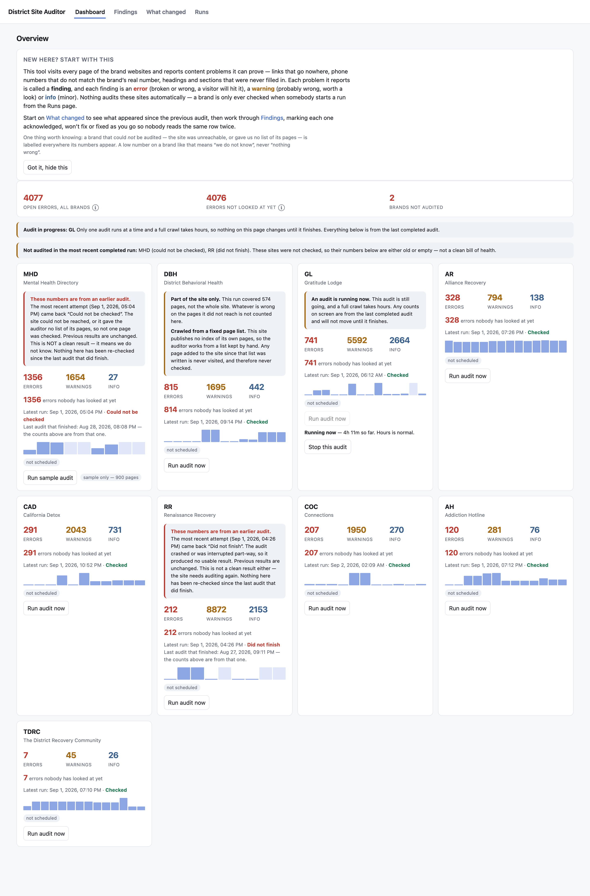
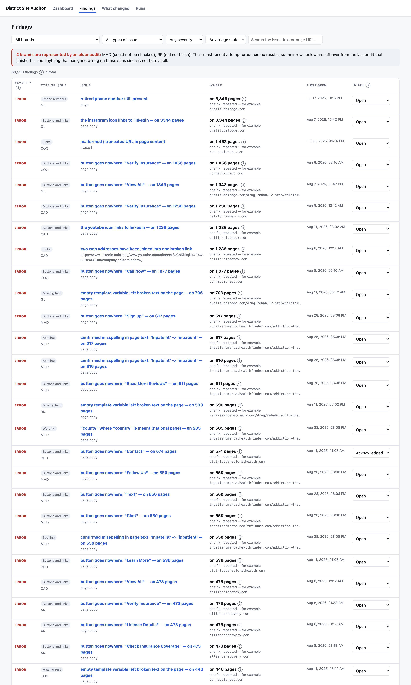
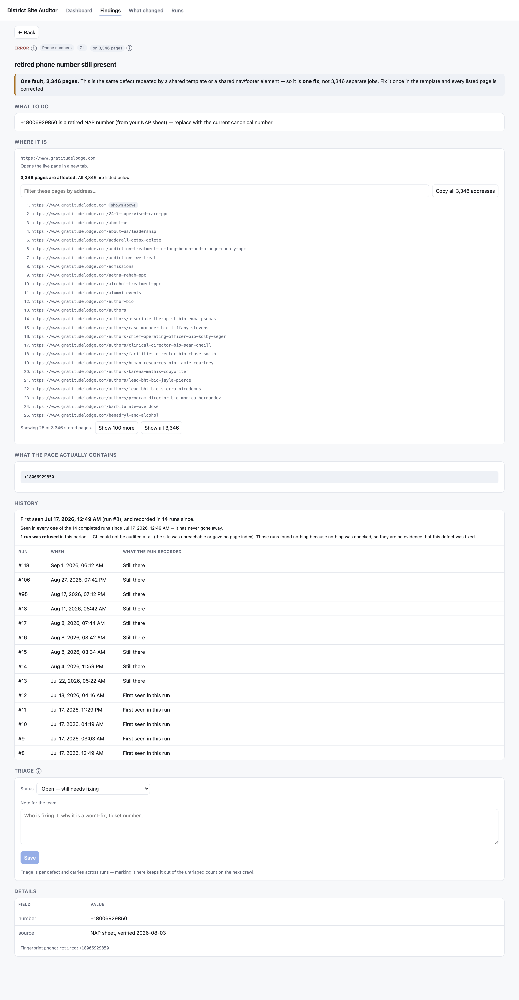
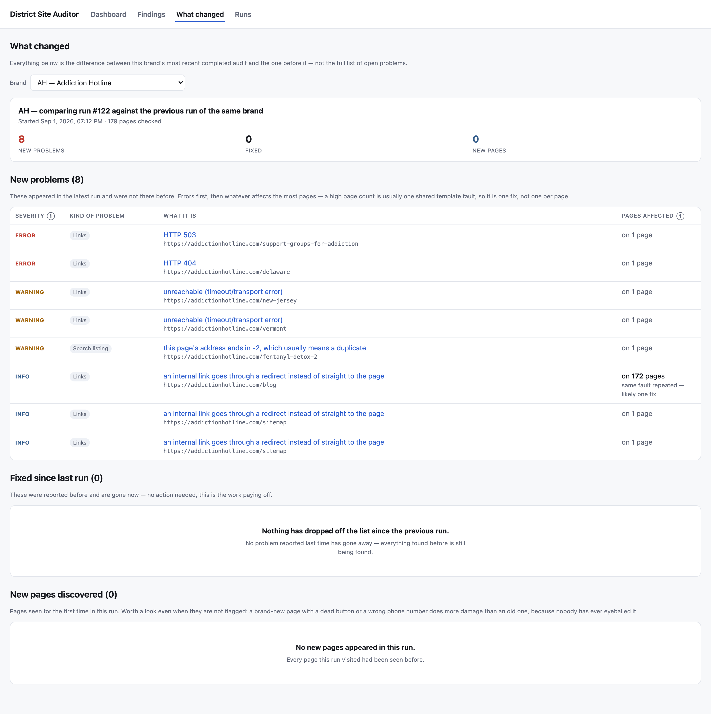
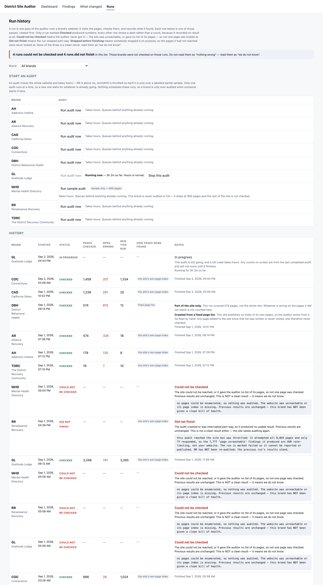

# District Site Auditor — what it is, in two minutes

It crawls all nine District brand websites and writes every content problem it finds into one
Google Sheet, a tab per brand. It runs on a laptop, takes about twelve hours, and costs nothing to
run. Nobody has to look at a page for it to be checked.

**Why it exists.** Blue Media kept finding broken content by hand — wrong phone numbers, buttons
that go nowhere, half-finished sentences, another brand's name on the wrong site — and reported it
in seven PDFs over two months. Every one of those reports is a page somebody had to open and read.
This tool finds that class of problem across ~31,000 pages without anyone reading them.

---

## What it checks

* **Phone numbers** — missing, malformed, out of date, shown-differently-than-dialled, and the big
  one: **a number that dials a different District brand**.
* **Buttons and links that go nowhere** — a "Verify Insurance" or "Learn More" with no destination.
* **Broken links** — dead links, redirects, links to leftover `-old`/`-copy` pages, malformed and
  doubled-up web addresses, social icons pointing at the wrong network.
* **Unfilled template fields** — both the visible kind (`[acf field=geo]` printed on the page) and
  the invisible kind that leaves broken wording behind: *"There are at least outpatient drug rehab
  programs available within of California"*.
* **Placeholder text that reached the live site** — "No content found", lorem ipsum.
* **Repeated content** — the same paragraph twice on one page, the same link twice in one list.
* **Blank slots** — an empty cell in a table where every other cell is filled.
* **Page structure** — missing or duplicated headings, missing or duplicated search-engine titles.
* **Spelling** — a curated list of confirmed misspellings, including in web addresses.
* **Wrong brand named in the copy** — "Gratitude Lodge" appearing on the Connections site.
* **Pages that are live but missing from the sitemap.**

## What it found

Across the nine brands it currently reports **~35,000 open findings**, but that number is
misleading in a useful way: most of it is a **small number of template faults repeated across
thousands of pages**. One missing word — *"within 25 of Long Beach"* should say "miles" — accounted
for 4,002 rows on Gratitude Lodge alone. The tool groups those, so what a person actually triages
is far smaller: **Connections went from 2,783 urgent items to 117; Gratitude Lodge from 5,291 to
506.**

Findings worth naming:

* **District Behavioral Health's recent rebuild shipped a dead "Learn More" button on 524 of its
  561 pages**, and **17 of its pages dial Renaissance Recovery's phone number**.
* **A footer fault on four brands, covering 12,823 pages** — web addresses welded together, doubled
  slashes, and social icons pointing at the wrong network. Gratitude Lodge currently has **no
  working Instagram link at all**. Each is a single template field: one edit fixes every page.
* The problems Blue Media reported by hand are now caught automatically — including the exact
  "Gratitude Lodge on the Connections site" case, and the `Inpateint` misspelling on 352 pages.

## What it looks like

The Google Sheet is the delivery surface, but there is also a web view of the same data — the
screenshots below are the real thing against the real database, not mockups. It is built as static
files and served alongside the API; `deploy/README.md` covers serving it.

**Overview** — every brand, its open counts, and how many nobody has looked at yet. A brand that
could not be audited says so on its own card instead of showing a low number that reads like good
news. One caveat visible in this shot: the intro panel says audits run overnight, which is what the
database records as *intended* — no timer is installed on this machine, so today nothing runs unless
a person starts it. "Nothing runs it" below is the operative fact.



**Findings** — one row per defect, not per page. "on 3,346 pages" means one template fault repeated,
so it is one fix. Filter by brand, type, severity or triage state.



**One finding** — what to do about it, every affected address, the exact text found on the page, and
the run-by-run history of whether it has ever gone away. Triage set here carries across runs, so
nobody reads the same row twice.



**What changed** — the difference between a brand's last two audits: what appeared, what went away,
what pages are new. This is where you start after a run.



**Runs** — start an audit, and read the history of every pass. Runs that could not be checked or did
not finish show a dash rather than a count, and say in words why that is not a clean result.



## What it cannot see

It reads the HTML a page sends; it does not open a browser. So it cannot see **anything visual**:
colour and contrast, a form that looks cut off, layouts that break on a phone, broken image icons,
or page speed. It also cannot tell whether a `<button>` works, because that lives in JavaScript it
does not run — it checks links only. **All of these were genuinely reported by Blue Media, and none
is covered.** A clean run does not mean those are fine. Full detail:
[`WHAT_THE_AUDIT_DOES_NOT_CHECK.md`](WHAT_THE_AUDIT_DOES_NOT_CHECK.md).

It also does not judge writing. Two attempts at automated grammar/spelling were built, measured and
**rejected** for flagging too much that was not wrong — the write-ups are in `ARCHITECTURE.md`
(D9, D10). That was a deliberate choice: a tool that cries wolf stops being read.

## Three things to know before relying on it

1. **Nothing runs it.** There is no schedule. It runs when a person runs it — one command, about
   twelve hours. If nobody runs it, nothing is checked.
2. **Inpatient Mental Health Finder is only ever sampled.** Its host collapses under normal
   crawling, so a full pass would take ~85 hours. What gets published is labelled `PARTIAL SAMPLE`.
3. **District Behavioral Health is audited from a fixed page list**, because its new platform
   publishes no page index. **Pages added after that list was written are invisible** and will
   never be checked until someone regenerates it.

## Running it

Everything a non-developer needs is in [`../README.md`](../README.md) — start with the warning at
the top about stopping the machine sleeping, which has cost days twice.

```
caffeinate -s python3 -m auditor.cli all -b tdrc -b ah -b ar -b dbh -b cad -b coc -b gl -b rr
```
